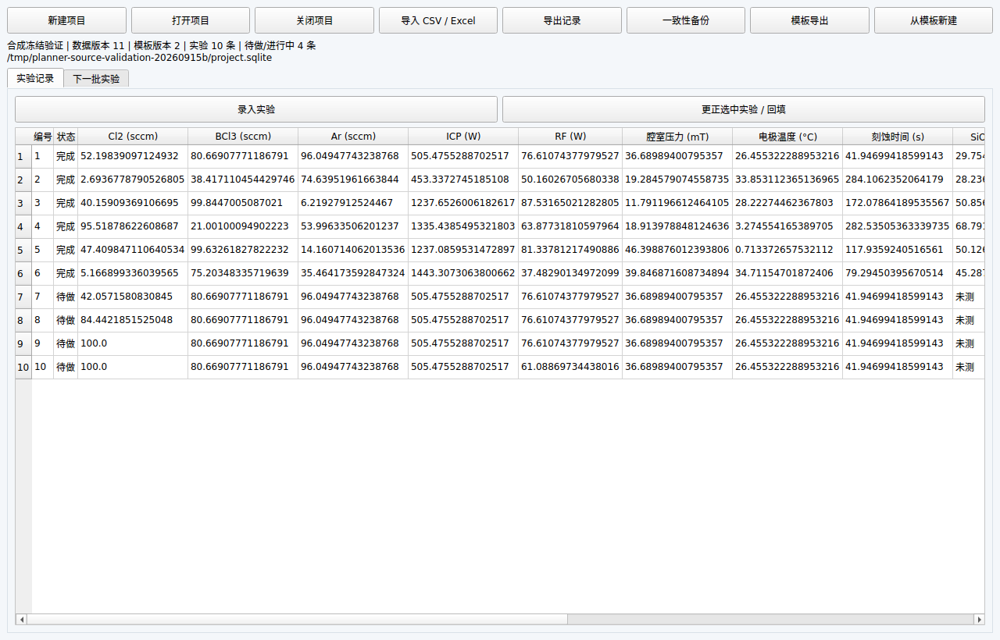

# 验收结果与开发记录

日期：2026-09-15。软件：0.1 开发原型。需求基线：仓库内 V1.1 规格。

## 当前实际证据

- Ubuntu / Python 3.12：核心、存储、模型、后台取消、本地图形与 Qt 测试最终全量 **65 项通过**（0 失败、0 错误，23.62 秒）。待做点多轮回归已包含。机器可读证据：[linux-validation.json](evidence/baseline-linux-validation.json)。
- GP-RBF、GP-Matérn 2.5、贝叶斯线性真实拟合；Bernoulli-logit 概率后验；qLogNEHVI 三种分母策略已有运行证据。
- Qt 离屏窗口完成创建项目、记录显示、关闭重开测试。无显示桌面的服务器不等同于人工交互验收。
- Windows 构建脚本与工作流已编写；尝试建立验证分支时 GitHub API 返回 `403 Resource not accessible by integration`，本地 gh 未登录。未创建远程分支、未启动 Windows CI、未交付 Windows EXE。
- `--self-test` 的三个模型、多轮待做、spawn 和 SQLite 备份恢复均实际通过；摘要已保存在上述证据 JSON。

## 阶段状态

| 阶段 | 状态 | 主要剩余工作 |
| --- | --- | --- |
| P0 | 工程与测试入口已建立 | 持续维护证据 |
| M0 | 进行中，Windows 验证未通过 | Windows 干净机/冻结测试；完整 Ax Modular 自定义适配 |
| M1 | 核心已实现、未整阶段验收 | 完整字段/模板编辑与迁移、建模取整 |
| M2a | 差值与共享样本已实现 | 一般公式区间传播、非对称分布、跨实验模型相关性 |
| M2b | 模型核心原型已验证 | GP 导数先验、局部先验、混合噪声、完整能力组合 |
| M2c | 受限候选与 qLogNEHVI 原型已验证 | 组合约束、整齐偏好、更多输出约束与目标组合验收 |
| M3 | SQLite/修订/备份及表格原型已验证 | 迁移、完整映射界面、全部单元元数据往返 |
| M4 | 最小窗口原型 | 依流程等待 Windows 基础验证后完成大规模表单与图形 |
| M5 | 未验收 | 正式目录包、无 Python 断网主机、许可证与出网监测 |
| M6 | 未开始 | 公司内真实场景，由用户本地实施 |

## A01–A50 跟踪

“子检查通过”不代表整项正式验收通过，尤其是跨平台、完整角色组合与人工流程。

| 编号 | 验收动作 | 状态 | 证据 / 缺口 |
| --- | --- | --- | --- |
| A01 | 无Python、无互联网的Windows电脑启动发布包 | 未验证（需 Windows/人工/升级） | 相关模块已建立，完整验收证据待补齐 |
| A02 | 用户建立并保存一个schema v2模板 | 进行中 | 相关模块已建立，完整验收证据待补齐 |
| A03 | 同一模板建立两个项目 | 进行中 | 相关模块已建立，完整验收证据待补齐 |
| A04 | 修改公共模板 | 进行中 | 相关模块已建立，完整验收证据待补齐 |
| A05 | 导入缺列、非法值或不匹配单位的数据 | 进行中 | 相关模块已建立，完整验收证据待补齐 |
| A06 | 重复导入同一实验结果 | 进行中 | 相关模块已建立，完整验收证据待补齐 |
| A07 | 请求1组及多组建议 | 进行中 | 相关模块已建立，完整验收证据待补齐 |
| A08 | 初始数据为空或不足 | 进行中 | 相关模块已建立，完整验收证据待补齐 |
| A09 | 候选不足、初始化受限或没有可行条件 | 进行中 | 相关模块已建立，完整验收证据待补齐 |
| A10 | 要求步长、固定值和类别参数 | 进行中 | 相关模块已建立，完整验收证据待补齐 |
| A11 | 提交一组已完成实验后再次推荐 | 进行中 | 相关模块已建立，完整验收证据待补齐 |
| A12 | 对某已做条件安排复测 | 进行中 | 相关模块已建立，完整验收证据待补齐 |
| A13 | 修改实际执行条件 | 进行中 | 相关模块已建立，完整验收证据待补齐 |
| A14 | 更正一条历史结果 | 进行中 | 相关模块已建立，完整验收证据待补齐 |
| A15 | 失败、取消或部分结果 | 进行中 | 相关模块已建立，完整验收证据待补齐 |
| A16 | 关闭、重启或中断计算 | 进行中 | 相关模块已建立，完整验收证据待补齐 |
| A17 | 切换GP-RBF、GP-Matérn与非GP预设 | 进行中 | 相关模块已建立，完整验收证据待补齐 |
| A18 | 执行指定条件预测 | 进行中 | 相关模块已建立，完整验收证据待补齐 |
| A19 | 中文用户名、空格路径与普通用户账户运行 | 未验证（需 Windows/人工/升级） | 相关模块已建立，完整验收证据待补齐 |
| A20 | 备份并在另一台离线测试机恢复 | 未验证（需 Windows/人工/升级） | 相关模块已建立，完整验收证据待补齐 |
| A21 | 在联网测试机启用应用出网阻断并监测 | 未验证（需 Windows/人工/升级） | 相关模块已建立，完整验收证据待补齐 |
| A22 | 断网完成建项目、导入、推荐、回填、恢复和导出 | 未验证（需 Windows/人工/升级） | 相关模块已建立，完整验收证据待补齐 |
| A23 | 非编程人员按说明独立操作 | 未验证（需 Windows/人工/升级） | 相关模块已建立，完整验收证据待补齐 |
| A24 | 使用离线升级包打开旧版本项目 | 未验证（需 Windows/人工/升级） | 相关模块已建立，完整验收证据待补齐 |
| A25 | 查看默认ICP模板 | 进行中（Ubuntu 子检查通过，非正式验收） | test_builtin_matches_spec |
| A26 | 录入4项厚度 | 进行中（Ubuntu 子检查通过，非正式验收） | test_formulas; test_revision_backup_and_isolation |
| A27 | 输入正负刻蚀量 | 进行中（Ubuntu 子检查通过，非正式验收） | test_formulas; test_nonlinear_shared_samples |
| A28 | 设置比值目标但B=0或不可分辨 | 进行中（Ubuntu 子检查通过，非正式验收） | test_formulas; test_partial_and_ratio |
| A29 | 选择分母策略与epsilon | 进行中（Ubuntu 子检查通过，非正式验收） | test_ratio_requires_explicit_strategy; test_qlog_batch_restore_and_stale_guard |
| A30 | 用100±1和90±1计算差值，误差为独立1σ | 进行中（Ubuntu 子检查通过，非正式验收） | test_independent_difference |
| A31 | 同样±1改为误差界限或95%区间 | 进行中（Ubuntu 子检查通过，非正式验收） | test_bounds_and_intervals |
| A32 | 设置共享误差和相关性 | 进行中 | test_shared_sources_and_dag; 跨实验相关似然未适配 |
| A33 | 编辑公式、形成循环、缺字段或单位冲突 | 进行中（Ubuntu 子检查通过，非正式验收） | test_formula_rejects_code; test_units_cycles_and_roles; test_versioned_formula_recompute |
| A34 | 原始测量也选为响应；辅助初始厚度仅参与差值 | 进行中 | 相关模块已建立，完整验收证据待补齐 |
| A35 | 把事后剩余厚度误选为未来预测输入 | 进行中（Ubuntu 子检查通过，非正式验收） | test_units_cycles_and_roles |
| A36 | 给Cl2对A设无关先验 | 进行中 | 相关模块已建立，完整验收证据待补齐 |
| A37 | 设置软正比与单调信息 | 进行中 | 相关模块已建立，完整验收证据待补齐 |
| A38 | 选择严格关系或不兼容模型 | 进行中 | 相关模块已建立，完整验收证据待补齐 |
| A39 | 输入/输出分别设0、1、−1位取整 | 进行中（Ubuntu 子检查通过，非正式验收） | test_rounding; test_grid_and_conflict；建模变换未实现 |
| A40 | 显示B为0.0，但全精度B非零 | 进行中（Ubuntu 子检查通过，非正式验收） | test_display_does_not_modify_ratio |
| A41 | 单变量和双变量模式生成多组 | 进行中（Ubuntu 子检查通过，非正式验收） | test_subspaces; test_qlog_batch_restore_and_stale_guard |
| A42 | 取整后候选重合或变化消失 | 进行中（Ubuntu 子检查通过，非正式验收） | test_finite_pool_does_not_fill_duplicates |
| A43 | 请求基准/单A/单B/AB交叉布局 | 进行中（Ubuntu 子检查通过，非正式验收） | test_initialization_cross_quota |
| A44 | 为参数、厚度和整组条件添加备注 | 进行中 | 相关模块已建立，完整验收证据待补齐 |
| A45 | 导入True、False和空布尔值 | 进行中（Ubuntu 子检查通过，非正式验收） | test_boolean；导入组合待补验 |
| A46 | 选择预测布尔响应 | 进行中（Ubuntu 子检查通过，非正式验收） | test_bernoulli_single_class_and_joint |
| A47 | 从A、B联合样本生成三个目标预测 | 进行中（Ubuntu 子检查通过，非正式验收） | test_nonlinear_shared_samples; test_real_model_fit_and_joint_prediction |
| A48 | 生成一维/二维趋势图 | 进行中 | plots/trends.py；test_local_one_and_two_dimensional_plots；交互图形页面未实现 |
| A49 | 不填本轮初始厚度却请求剩余厚度预测 | 进行中 | 相关模块已建立，完整验收证据待补齐 |
| A50 | 离线运行先验、公式、不确定度、非GP和图形 | 未验证（需 Windows/人工/升级） | 相关模块已建立，完整验收证据待补齐 |

## 已修复的问题

1. Ax 1.3.1 的 Data 必须带 metric_signature：由已注册 Metric 生成。
2. 已有待做点时 qLogNEHVI 未建立 cell bounds：启用官方 pending cache，并验证第二轮推荐。
3. 未提供误差及分母不稳定不能补零：单元/模型测试覆盖。
4. Qt 缺少 libGL 与中文字形：安装开发系统库，随应用提供未修改的 Noto Sans CJK 字体及 OFL；已测试中文字形并检查截图。
5. 多连接模板缓存与生成冲突：模板重新加载、提交检查版本，跨窗口 filelock 与子进程取消测试通过。

## 界面证据

截图是 Ubuntu 离屏窗口，不代表 Windows 人工操作验收。

## 安装包验证

已生成 `dist/experiment_planner-0.1.0-py3-none-any.whl`，检查其中包含 ICP 模板、Noto Sans CJK 字体与 OFL。在独立临时目录解包后，确认导入来自该目录，并执行 Qt `--smoke` 成功。该文件是 Python 安装包，不是 Windows EXE，也不包含全部依赖。
